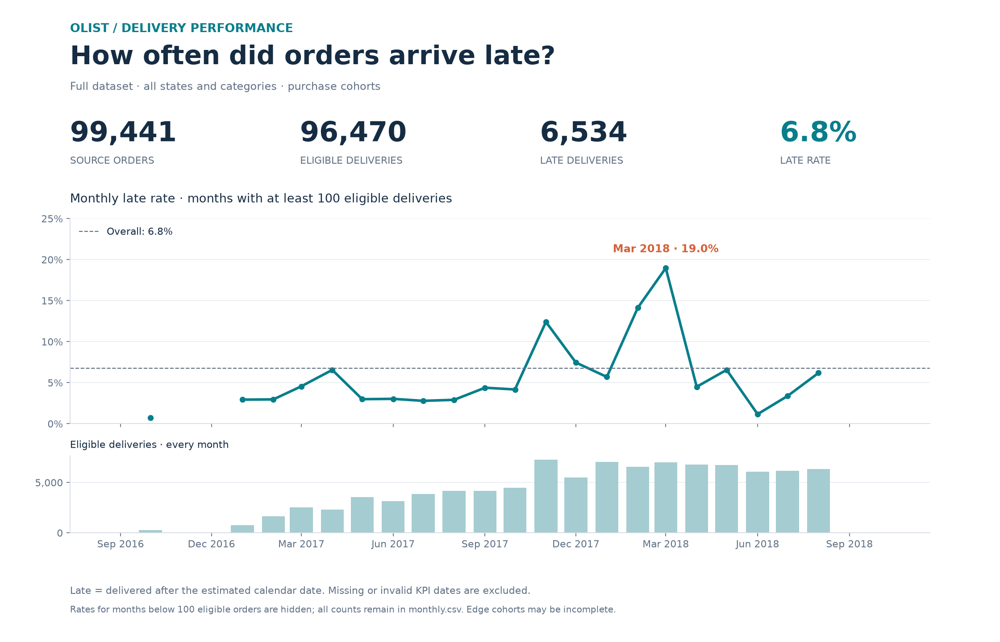
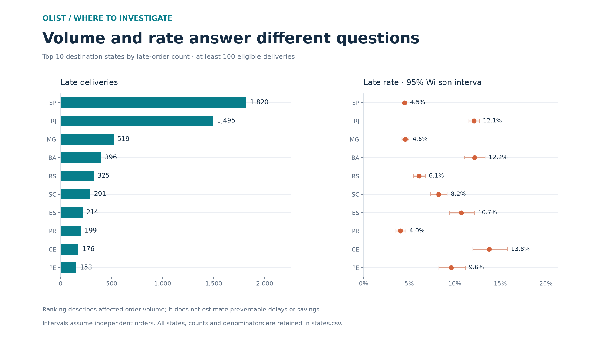

# Delivery results

| Read the chart | Definition |
|---|---|
| Late rate | Late deliveries ÷ eligible deliveries |
| Eligible | Delivered status with usable purchase, delivery and estimate dates |
| Month | Month of purchase |
| State | Customer destination state |
| Monthly rate chart | Months with at least 100 eligible deliveries; all monthly counts shown below |
| State chart | Top 10 by late-order count, among states with at least 100 eligible deliveries |

| Supporting file | Contents |
|---|---|
| [monthly.csv](monthly.csv) | Every month, order counts, eligible counts and late rates |
| [states.csv](states.csv) | Every state, counts, rates and 95% Wilson intervals |
| [quality.csv](quality.csv) | All quality checks; `error` is severity, while `issues` is the failure count |
| [provenance.json](provenance.json) | Input hashes, saved source run, scope and overall counts |

Rates in CSVs are proportions: `0.0677` means about `6.77%`. Blank rates mean no eligible deliveries. Warnings can overlap and should not be added together.

The overall rate includes every eligible delivery, including small months hidden from the monthly rate line. Edge cohorts may be incomplete. Ranking identifies affected volume, not preventable delays. Wilson intervals assume independent orders and do not establish causation.